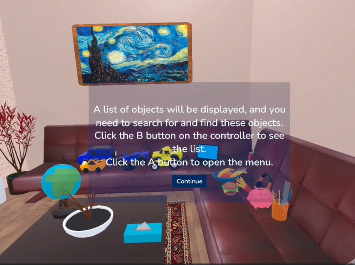
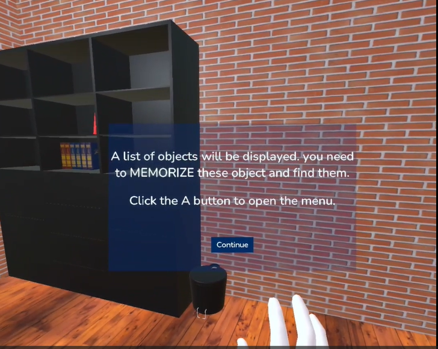
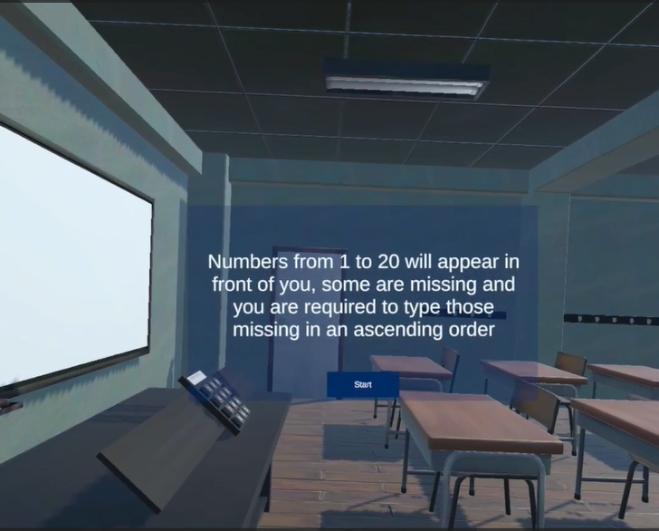
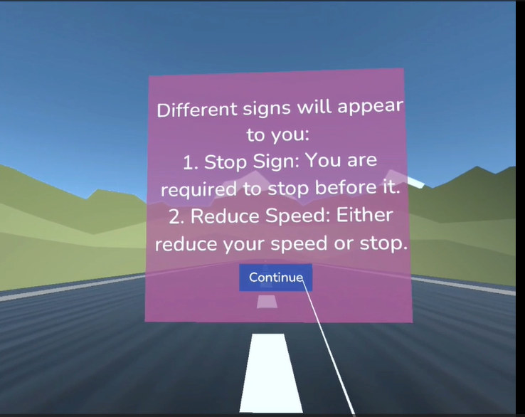

# VR Cognitive Training Game

**Project Overview:**

This VR game is developed as part of our graduation project titled "Investigating the Influence of Immersion Level on the Engagement Level in Cognitive Training." The aim of this study is to compare the impact of immersion on engagement by evaluating participant interaction with a VR game and a desktop-based training tool (RehaCom).

---

**Game Description:**

The game includes two cognitive training modules:

1. **Visual-Spatial attention**, module which consists of two games:

   - ***Exploration***, which consists of two levels:

     a) In the first level, a list appear with items you should search for in a living room, and you can return back to the list if you forget what you are searching for.

     b) In the second level, you should memorize the items on the list and search for them in an office you can't return back to the list if you forget what you are searching for.
     

     <!-- First image with caption -->
     

     
      
     
     *Sample of Instructions for First Level*

     

     

     
      

     *Sample of Instructions for Second Level*

     

     

   - ***Missing Numbers***:

     In this game, you are required to find the missing number from 1 to 20 but write them in an ascending order.
          

             
              
      *Sample of Instructions for Missing Number Game*
             

2. **Divided attenion module**:

   In this game, you are required to drive a car using the controllers and you can stop using the joystick of the right controller. You will listen to audios that you should follow and takecare of the signs will appear in front of you.
   

       
        
        Sample of Instructions for Divided Attention Game
       
    

**Tutorial:**

The tutorial part is for how to use the controllers and interact with the games and how to use the hand on the scene to interact with the environment. There is a button that you can click more than once and a box to grab several times and drop it  till you find yourself familiar with the virtual environment. 

**VR Questionnaire:**

User Engagement Scale (UES) questionnaire, but the users are required to fill it in with the VR so not get out of the immersion.
